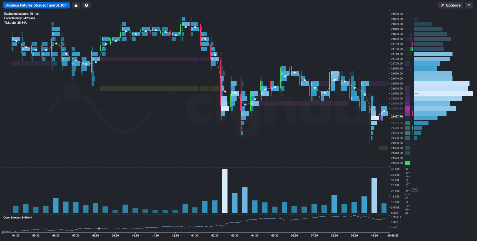

##### Overview:

[The Edge Imbalance](https://cignals.substack.com/p/the-edge-imbalance-a-new-order-flow)

Delta -

Total Volume -

Naked Point of Control (nPOC) - Purple Lines
- A price that was beginning to establish itself as the point of control, before a change in the direction of said price happened. Subsequently, the nPOC remains 'naked' (often called virgin) until price comes back and revisits this level.

Edge Imbalance (EI) - Yellow Line
- The availability of excess liquidity on the bid or ask that occurs as an auction process attempts to complete itself. This usually indicates that price discovery has not been exhausted yet, and price will eventually come back to test this level again.

Balanced Target (BT)
- Projected level that completes a symmetrical balanced 'D' shaped bell curve (profile).

Buy-Side-Imbalance

Sell-Side-Imbalance

<>
